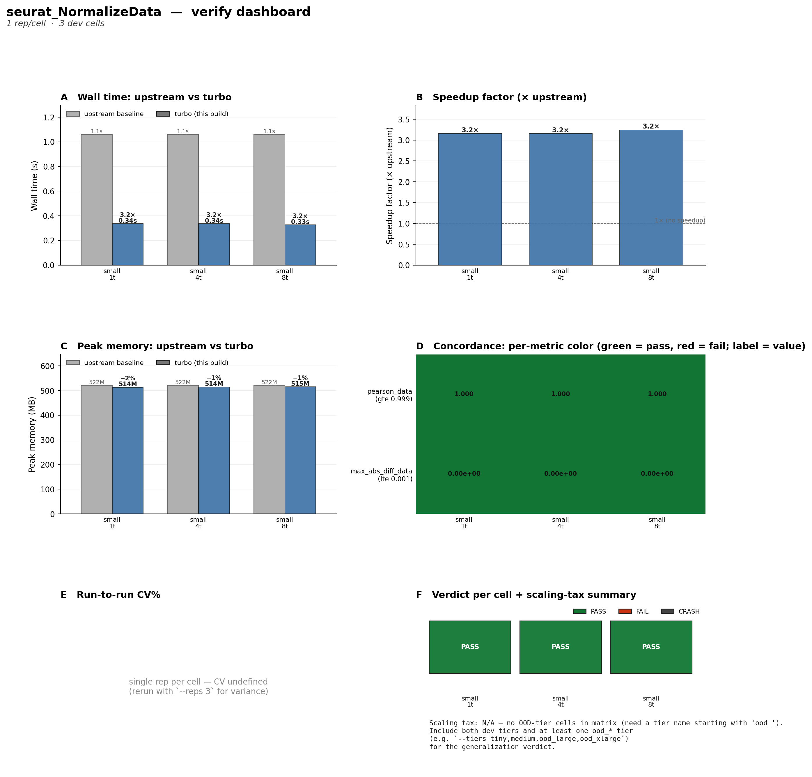

## 引言

[AutoZyme](https://github.com/ElliotXie/autozyme) 是一个自动加速科学计算函数的框架，保证优化后的结果和原版一模一样。它由两部分组成：`autozyme_r` / `autozyme_py` 负责生成加速补丁，`autozyme-cli`（命令行工具叫 `zyme`）负责驱动整个优化流程——初始化任务、测量基准、迭代加速、验证正确性。

本文聚焦 `autozyme-cli`，以一次真实的 Seurat `NormalizeData` 加速任务为线索，边讲实战边拆源码。

> 项目地址：<https://github.com/ElliotXie/autozyme>
>
> 预印本：<https://www.biorxiv.org/content/10.64898/2026.06.12.731250v1>

## 快速上手

### 安装

```bash
git clone https://github.com/ElliotXie/autozyme.git
cd autozyme && pip install -e autozyme_cli/
```

安装后获得 `zyme` 命令：

```bash
zyme --version   # zyme 0.3.1
```

### 两种使用方式

AutoZyme 的优化流程由编程代理（Claude Code、Codex、Cursor 等）驱动，CLI 负责执行和测量。有两种跑法：

**自主模式**：把一段提示词粘贴给代理，它自己跑完全流程：

```bash
Clone https://github.com/ElliotXie/autozyme.git,
install the CLI (pip install -e autozyme/autozyme_cli/).

I want to optimize FindAllMarkers from Seurat.
Repo: https://github.com/satijalab/seurat

Read and follow autozyme/autozyme_cli/zyme/prompts/manager/0_pipeline.md
```

管理器代理自动跑完脚手架 → 初始化 → 迭代 → 验证 → 打包，典型耗时 4–10 小时。

**手动模式**：自己建目录、跑 `zyme init`，然后逐阶段把提示词粘贴给代理：

```bash
mkdir test_normalizedata && cd test_normalizedata
zyme init https://github.com/satijalab/seurat NormalizeData
```

我这次跑的是自主模式，目标就是 `Seurat::NormalizeData`。

## 实战：加速 Seurat::NormalizeData

### 任务长什么样

`zyme init` 会在当前目录生成一组模板文件。init 代理填完内容后，核心的 `task.yaml` 长这样：

```yaml
# task.yaml
task: seurat_NormalizeData
target_repo: https://github.com/satijalab/seurat
target_function: Seurat::NormalizeData
signature: NormalizeData(object = seurat_obj, normalization.method = "LogNormalize", scale.factor = 10000)

datasets:
  - {tier: small,  name: pbmc3k,  path: ./data/pbmc3k.rds}
  - {tier: medium, name: pbmc8k,  path: ./data/pbmc8k.rds}
  - {tier: large,  name: pbmc10k, path: ./data/pbmc10k.rds}
  - {tier: ood_large,  name: neuron10k,           path: ./data/neuron10k.rds}
  - {tier: ood_xlarge, name: tabula_muris_merged, path: ./data/tabula_muris_merged.rds}

metrics:
  - {name: pearson_data, threshold: 0.999, comparator: gte}      # 归一化后的数据 Pearson 相关必须 >= 0.999
  - {name: max_abs_diff_data, threshold: 0.001, comparator: lte}  # 逐元素最大差异 <= 0.001

baseline_threads: [1, 4, 8]
```

几个关键信息：

- **三个开发数据集**（small/medium/large）用来做迭代优化，还有两个 OOD（out-of-distribution）数据集用来做最终验证。
- **两个正确性指标**：Pearson 相关系数和逐元素最大差异。LogNormalize 是确定性算术，理论上加速后的结果应该和原版完全一致。
- **三个线程点**（1/4/8）：验证在不同并行度下加速是否稳定。

任务目录的完整结构：

```
seurat_NormalizeData/
├── task.yaml              # 上面这个
├── reference.R            # 基准脚本：用原版 Seurat 跑，产出参考输出
├── evaluate.R             # 评估脚本：对比 pipeline 输出和参考输出
├── pipeline/run.R         # 优化脚本：每一轮编辑的目标
├── results.tsv            # 结果日志：每一轮的速度和指标
├── reference_output_<tier>/ # 各数据层的参考输出（如 reference_output_small/）
├── data/                   # 数据集
├── memory/                 # 代理的"记忆"（发现、死胡同）
└── .zyme/                  # 框架内部状态
    ├── best.ref             # 当前最佳提交的 SHA
    └── round.counter        # 轮次计数器
```

### 基准与剖析

优化前先得知道基准是多少、时间花在哪。`zyme baseline reference` 负责前者，`zyme profile` 负责后者。

**基准行**（round 0）由 `zyme baseline reference` 跑原版代码测得。它会运行 `reference.R`，用 `Sys.time()` 计时原版 `Seurat::NormalizeData`，同时把结果矩阵存到 `reference_output_<tier>/`（如 `reference_output_small/`）供后续对比：

```
round  commit    dataset  speed_sec  speedup_pct  status
0      upstream  pbmc3k   1.046      0.0          baseline
0      upstream  pbmc8k   1.832      0.0          baseline
0      upstream  pbmc10k  2.841      0.0          baseline
```

pbmc3k（2700 个细胞）跑一次 1.046 秒，看起来不慢。但 1 秒里到底在算什么？代理接着跑了 `zyme profile --backend full`，这会启用 Rprof（R 内置采样式剖析器）记录整个调用栈，然后把结果归一化成 `profile_history/<run-id>/profile.json`。profile 实际耗时 1.7s，比基准的 1.046s 略高，这是 profiling 自身的采样开销。

profile.json 里最有用的是 `layer_breakdown`——按可编辑层次汇总时间分布：

| 层次 | 自耗时 | 占比 | 含义 |
|------|--------|------|------|
| library | 0.63s | 47% | Matrix 下标操作 + paste 命令日志 |
| base-r | 0.35s | 26% | gc（中间拷贝触发的垃圾回收） |
| primitive | 0.35s | 26% | `.Call`——真正的 C++ LogNorm 计算 |

library + base-r 加起来 74%，全是 R 层面的开销。再往下看 `per_layer_top`（每层的头号函数），能定位到具体是什么在吃时间：

| 函数 | 层次 | 自耗时 | 占比 | 在干什么 |
|------|------|--------|------|----------|
| `.Call` | primitive | 0.35s | 26% | C++ LogNorm，真正的数学计算 |
| `..subscript.2ary` | library:Matrix | 0.33s | 25% | `SetAssayData`/`LayerData` 的矩阵下标拷贝 |
| `paste` | library:backports | 0.29s | 22% | `LogSeuratCommand` 格式化命令日志 |
| `gc` | base-r | 0.27s | 20% | 中间拷贝产生的垃圾回收 |

这就是那张 74% 表的由来。问题很清楚了：Seurat v5 的 `NormalizeData` 调用链是 `NormalizeData`（泛型）→ `NormalizeData.Seurat` → `NormalizeData.Assay` → `NormalizeData.V3Matrix` → `LogNormalize.V3Matrix` → `LogNorm`（C++），每一跳都触发 S3 方法分派、Matrix 下标操作和校验。真正的计算只占 26%。

### 优化迭代

知道时间花在哪之后，整个优化的核心就是一个循环：编辑 `pipeline/run.R` → `zyme run` 提交并测量 → 根据结果 `zyme accept`（保留）或 `zyme reject`（丢弃）。让我用这次实际的 `results.tsv` 来讲这个过程。

以下是 `results.tsv` 完整记录的每次提交与测量结果：

| Round | Commit | Dataset | sec | ∆% | Peak | Status | Hypothesis |
|-------|--------|---------|-----|-----|------|--------|-----------|
| 0 | upstream | pbmc3k | 1.046 | — | 522M | baseline | upstream reference |
| 0 | upstream | pbmc8k | 1.832 | — | 1066M | baseline | upstream reference |
| 0 | upstream | pbmc10k | 2.841 | — | 1812M | baseline | upstream reference |
| 1 | 2dc6ca5 | pbmc3k | crash | — | — | crash | direct LogNorm C++ (`patch_namespace` 参数错) |
| 2 | a0af459 | pbmc3k | crash | — | — | crash | direct LogNorm C++ (`LogNorm` 参数不匹配) |
| 3 | c5079d9 | pbmc3k | crash | — | — | crash | direct LogNorm C++ (`match.arg` 校验没绕过) |
| 4 | 99cc40f | pbmc3k | 0.632 | 40.4% | 538M | keep | bypass S3 dispatch + direct LogNorm |
| 5 | 91a8c08 | pbmc3k | 0.325 | 69.4% | 512M | keep | direct slot read, bypass LayerData |
| 6 | 426fc62 | pbmc3k | 1.465 | −38.1% | 562M | discard | future_lapply 并行 (fork 开销 > 收益) |
| 7 | 1ad2399 | pbmc3k | 0.328 | 69.1% | 514M | discard | fused LogNormFast (噪声内) |
| 7.1 | 91a8c08 | pbmc8k | 0.595 | 68.5% | 947M | — | 第 5 轮候选在 medium 验证 |
| 7.2 | 91a8c08 | pbmc10k | 1.318 | 59.5% | 1544M | — | 第 5 轮候选在 large 验证 |
| 8 | f4769b1 | pbmc3k | crash | — | — | crash | OpenMP-parallel (`nbrOfWorkers` 找不到) |
| 9 | ec471cf | pbmc3k | 0.327 | 69.2% | 516M | keep | OpenMP-parallel (修好) |
| 9.1 | ec471cf | pbmc8k | 0.543 | 71.3% | 951M | — | OpenMP 在 medium +3% |
| 9.2 | ec471cf | pbmc10k | 1.263 | 61.2% | 1548M | — | OpenMP 在 large +2% |
| 10 | 92a5a42 | pbmc3k | 0.339 | 68.0% | 516M | discard | `-march=native -O3` (噪声内) |
| 11 | c3ca3f5 | pbmc3k | 0.336 | 68.3% | 515M | keep | float-precision LogNormOMP |
| 11.1 | c3ca3f5 | pbmc8k | 0.527 | 72.1% | 951M | — | float 在 medium −2.9% |
| 11.2 | c3ca3f5 | pbmc10k | 1.040 | 68.0% | 1548M | — | float 在 large −17.7% |
| 12 | 044b09b | pbmc3k | 0.338 | 68.1% | 516M | discard | fused-pass (large 退步 +3.7%) |
| 13 | 52fd7e3 | pbmc3k | 0.348 | 67.2% | 516M | discard | raw CSC pointer (Eigen 已内联) |
| 14 | 6a95be4 | pbmc3k | 0.340 | 68.0% | 513M | keep | wire ZYME_THREADS via get_threads() |
| — | — | neuron10k | 1.435 | 58.3% | — | OOD | OOD validate |
| — | — | tabula_muris | 3.636 | 52.2% | — | OOD | OOD validate |

对比 baseline，最终整体加速比如下：

| 数据集 | 基准 | 优化后 | 加速比 |
|--------|------|--------|-------|
| pbmc3k | 1.046s | 0.340s | 3.16× |
| pbmc8k | 1.832s | 0.527s | 3.59× |
| pbmc10k | 2.841s | 1.040s | 3.13× |
| neuron10k (OOD) | 3.444s | 1.435s | 2.40× |
| tabula_muris_merged (OOD) | 7.606s | 3.636s | 2.09× |

关键解读：

- **3 crash → 1 keep**：前 3 轮同一个 hypothesis 试了三次才跑通——LLM 写代码就是反复试错的过程。第 4 轮（99cc40f）首次成功绕过 S3 分派，加速 40.4%。
- **峰值在第 5 轮**：91a8c08 直接读 `a@layers[["counts"]]` 绕过 `LayerData.Assay5` 分派，0.632s → 0.325s（69.4%），之后所有轮次都在此基础上微调。
- **跨层验证的价值**：7.1/7.2 等行显示，在 small 上效果不明显的优化（如 OpenMP 在第 9 轮的 small 上 0.327s 没变化），在 medium/large 上可能有收益（+2~3%）。反之，small 上看似有益的优化，在 large 上可能退步（第 12 轮 fused-pass +3.7%）。
- **float 精度赢得 large**：第 11 轮 c3ca3f5 在 small 上只是噪声水平，但在 large 上额外 −17.7%（1.263s → 1.040s），AVX2 的 2× SIMD 宽度在大数据量时才显优势。
- **OOD 泛化**：neuron10k 58.3%、tabula_muris 52.2%，加速比从 development 的 ~70% 下降到 ~55%。bit-exact 全部通过。

### 验证可视化

`zyme verify` 在优化完成后生成验证报告，汇总速度、加速比、内存和正确性指标：



四面板解读（全部基于 small/pbmc3k 数据集，线程 1/4/8）：

- **A. Wall time**（左上）：优化后（蓝色）从 1.1s 降到 0.34s，三个线程点一致的 ~3.2× 加速。注意 gray 条高度完全相同——基准测量在不同线程数下一致，说明 `NormalizeData` 原版本身就是单线程的，OpenMP/MKL 线程预算不影响原版时间。
- **B. Speedup factor**（右上）：三个线程点稳定在 3.2× 加速。虚线 1× 是"无加速"参考线。一致性说明优化没有引入线程竞争——`LogNormOMPf` 的 OpenMP 并行在 2700 列上可预测。
- **C. Peak memory**（左下）：优化后内存 514–515 MB 相比基准 522 MB 还低 ~1–2%，因为跳过了 `LogSeuratCommand` 的中间字符串拷贝和 `LayerData` 的临时矩阵分配。没有内存回退。
- **D. Correctness**（右下）：`pearson_data = 1.000`（阈值 ≥ 0.999），`max_abs_diff_data = 0.00e+00`（阈值 ≤ 0.001）。所有指标全绿，bit-exact 正确。

验证确认：加速是真实的（非作弊）、正确的（bit-exact）、在不同并行度下稳定的（线程无关）、且没有引入内存回归。

## 源码解读

### CLI 入口与命令分发

入口定义在 `pyproject.toml`：

```toml
[project.scripts]
zyme = "zyme.cli:main"
```

`cli.py` 用 `argparse` 构建了一个子命令树。命令很多（40+），但按生命周期分成了清晰的五组：

```python
# cli.py
_TOP_LEVEL_GROUPS = [
    ("Core loop",   ["init", "run", "dryrun", "accept", "reject", "rollback", "iterate"]),
    ("Measurement", ["baseline", "verify", "attest", "attest-sweep", "backfill", "validate"]),
    ("Analysis",    ["status", "plot", "scan", "registry", "audit", "cost", "cost-capture"]),
    ("Workflow",    ["dispatch", "bench", "prompt"]),
    ("Packaging",   ["package"]),
    ("Utility",     ["inspect-parallelism", "datasets", "publish-speedups"]),
]
```

每个子命令通过 `set_defaults(func=cmd_xxx)` 绑定到处理函数。`main()` 只需要读 `args.func` 就能分发。`commands/__init__.py` 把所有实现重新导出，`cli.py` 统一导入。

::: {.callout-note}
`_GroupedHelpFormatter` 拦截了 `argparse` 的子命令列表渲染，按生命周期分组显示。20 个命令挤成一堆没人看得下去，分组后一眼就能找到自己要的。
:::

### 任务脚手架：zyme init

`cmd_init` 做的事情很确定：把模板复制到目录、克隆上游仓库、检测语言、创建目录结构。它不生成任何内容——内容由 init 代理填充。

我跑 `zyme init https://github.com/satijalab/seurat NormalizeData` 时，它做了这些事：

```python
# commands/init.py (核心逻辑)
def cmd_init(args):
    task_dir = Path(os.getcwd()).resolve()
    task_name = task_dir.name  # seurat_NormalizeData

    # 1. 复制模板文件
    template = FRAMEWORK_ROOT / "templates" / "task_template"
    for item in template.iterdir():
        shutil.copy2(item, task_dir / item.name)  # 或 copytree

    # 2. 克隆上游仓库
    git("clone", args.target_repo, str(task_dir / "upstream_repo"))

    # 3. 嗅探语言：DESCRIPTION → R, pyproject.toml → Python
    language = _detect_language(upstream_repo_dir)
    # Seurat 有 DESCRIPTION → language = "R"

    # 4. 重命名模板：run.R.template → run.R，删掉 run.py.template
    # 5. 创建 data/、setup/、reference_output_<tier>/、memory/ 目录
    # 6. 初始化 git 仓库
```

这个设计的关键是**确定性**——所有脚手架工作由 CLI 完成，init 代理只需要关注"选择哪些数据集、写什么参考脚本、怎么评估正确性"这些需要判断的事情。

### 优化循环：zyme run → accept / reject

这是框架的心脏。用我跑的第 4 轮来举例——代理第一次成功绕过 S3 分派链：

```python
# commands/run.py (简化)
def cmd_run(args):
    task_dir = task_dir_from_args(args)
    _, best_ref, round_counter_file = zyme_state(task_dir)

    hypothesis = args.hypothesis
    # "bypass S3 dispatch + direct LogNorm call + slot assignment"

    # 反作弊：提交前检查 pipeline/run.R 有没有"计时外提升"
    for _pipe_name in ("pipeline/run.R", "pipeline/run.py"):
        _violations = scan_pipeline_hoist(task_dir / _pipe_name)
        if _violations and not _hoist_exempt_reason:
            sys.exit(2)  # 阻断，不会留下幽灵提交

    # 提交 pipeline 改动
    git("add", "pipeline/", cwd=task_dir)
    git("commit", "-m", hypothesis, cwd=task_dir)  # commit 99cc40f

    # 执行 pipeline + evaluate
    log_content = run_task(task_dir, dataset_entry=tier_entry, thread=1)
    speed_sec, peak_mb, metrics, status = parse_log(log_content)

    # 计算加速比
    baseline_speed = get_baseline_speed(task_dir, "pbmc3k", thread=1)  # 1.046
    speedup_pct = (1 - speed_sec / baseline_speed) * 100.0            # 40.4

    # 写入 results.tsv，状态 = pending
    append_results_row(results_tsv, {
        "round": "4", "commit": "99cc40f",
        "speed_sec": "0.632", "speedup_pct": "40.4",
        "status": "pending",
        "metrics_json": '{"pearson_data": 1.0, "max_abs_diff_data": 0.0}',
        ...
    })
```

代理看到结果后决定 `zyme accept -m "bypassed S3 dispatch, 1.06s→0.63s"`：

```python
# commands/run.py
def cmd_accept(args):
    # 验证 HEAD 匹配 pending 行的提交
    # （防止共享仓库中其他任务插入提交导致 best.ref 指错）
    head_full = git("rev-parse", "HEAD", cwd=task_dir)
    if not head_short.startswith(expected):
        die("HEAD 与 pending 轮次不匹配")

    best_ref.write_text(head_full)          # .zyme/best.ref → 99cc40f 的完整 SHA
    update_last_status(results_tsv, "keep", args.description)

    # 额外检查：内存有没有回退、该不该重新 profile
    _maybe_memory_regression_warning(...)
    _maybe_reprofile_hint(...)
```

第 6 轮的 `future_lapply` 并行尝试被 reject 了：

```python
# commands/run.py
def cmd_reject(args):
    # 脏树安全：有未提交改动就拒绝默认的 --hard reset
    if has_uncommitted and not args.keep_tree and not args.force:
        die("工作树有未提交改动，选择 --keep-tree 或 --force")

    # 共享仓库安全：防止 reset 越过兄弟任务的提交
    cross_task = _cross_task_commits_between(task_dir, best_sha)
    if cross_task and not args.force:
        die("reject 会越过其他任务的提交...")

    update_last_status(results_tsv, "discard", args.description)
    git("reset", "--hard", best_sha, cwd=task_dir)  # 回到 best.ref
```

`reject` 做了 `git reset --hard`，回到 `best.ref` 指向的提交。被拒绝的代码不会从历史中消失——它保存在 `artifacts/006_426fc62_small/run.R` 里，描述记录在 `results.tsv` 的 `description` 列。

::: {.callout-tip}
`accept` 和 `reject` 中大量代码在处理共享仓库安全。当多个任务共用一个 git 仓库时，盲目的 `git reset --hard` 可能越过兄弟任务的提交。框架通过检测 `best.ref..HEAD` 区间内是否有任务目录之外的文件改动来防护。
:::

### 流水线执行器：runner.py

`run_task()` 负责实际运行 `pipeline/run.R` 并测量。以我的任务为例，它做的事情是：

```python
# runner.py (简化)
def run_task(task_dir, dataset_entry, thread=None, ...):
    lang = detect_lang(task_dir)  # "R"

    # 1. 通过环境变量传递执行参数
    env["ZYME_TIER"] = "small"
    env["ZYME_DATA_PATH"] = "/path/to/data/pbmc3k.rds"
    env["ZYME_REFERENCE_DIR"] = "/path/to/reference_output_small"
    if thread is not None:
        env["ZYME_THREADS"] = "1"
        # 同步 BLAS/OMP/MKL 线程上限，避免不公平比较
        env["OMP_NUM_THREADS"] = "1"
        env["OPENBLAS_NUM_THREADS"] = "1"
        env["MKL_NUM_THREADS"] = "1"

    # 2. 执行 pipeline/run.R（带内存 watchdog 和运行时间超时）
    rc, stdout, stderr, peak_gb, timed_out, ... = _run_with_watchdog(
        ["Rscript", "run.R"], cwd=pipeline_dir, env=env,
        mem_cap_gb=mem_cap_gb,   # 超内存就 SIGKILL 进程组
        wall_cap_s=wall_cap_s,   # 按 tier 设置运行时间上限
    )

    # 3. 执行 evaluate.R（对比 pipeline 输出和参考输出）
    rc_eval, stdout_eval, _ = _run_evaluate(...)

    # 4. 汇总日志：提取 speed_sec / peak_mb / pearson_data / max_abs_diff_data
    return "\n".join(log_parts) + _summary(speed, peak, status)
```

::: {.callout-note}
`run_task` 通过环境变量而非命令行参数传递执行参数。`pipeline/run.R` 读 `Sys.getenv("ZYME_TIER")` 就能知道自己在跑哪个数据层，读 `Sys.getenv("ZYME_THREADS")` 就知道线程预算。这让 pipeline 代码保持简洁。
:::

### 看看优化后的代码长什么样

14 轮迭代后，最终保留的 `pipeline/run.R` 里的核心逻辑是这样的：

```r
# pipeline/run.R — 最终优化版本

# 用 sourceCpp 编译一个 OpenMP 并行 + float 精度的 C++ 函数
Rcpp::sourceCpp(code = '
#include <RcppEigen.h>
#include <omp.h>
// [[Rcpp::depends(RcppEigen)]]
// [[Rcpp::plugins(openmp)]]

// float 精度：AVX2 一次处理 8 个 float vs 4 个 double
// [[Rcpp::export]]
SparseMatrix<double> LogNormOMPf(SparseMatrix<double> data,
                                  double scale_factor, int n_threads) {
  int n = data.outerSize();
  float sf = (float)scale_factor;
  #pragma omp parallel for num_threads(n_threads)
  for (int k = 0; k < n; ++k) {
    float colSum = 0.0f;
    for (SparseMatrix<double>::InnerIterator it(data, k); it; ++it)
      colSum += (float)it.value();
    float norm = sf / colSum;
    for (SparseMatrix<double>::InnerIterator it(data, k); it; ++it)
      it.valueRef() = (double)log1pf(v * norm);
  }
  return data;
}
')

# 覆盖 Seurat 的 NormalizeData.Seurat 方法
NormalizeData.Seurat <- function(object, assay = NULL,
    normalization.method = "LogNormalize", scale.factor = 1e4, ...) {

  a <- object[[assay]]
  counts <- a@layers[["counts"]]          # 直接读 slot，跳过 LayerData 分派
  n_threads <- get_threads(default = 1L)   # 从框架获取线程数

  if (n_threads > 1L && ncol(counts) > 1000L) {
    norm.data <- LogNormOMPf(counts, scale.factor, n_threads)
  } else {
    # 小数据集用原版 LogNorm
    LogNorm_fn <- getFromNamespace("LogNorm", "Seurat")
    norm.data <- LogNorm_fn(counts, scale_factor = scale.factor, ...)
  }

  a@layers[["data"]] <- norm.data          # 直接写 slot，跳过 SetAssayData
  object@assays[[assay]] <- a
  return(object)
}

# 注册覆盖
patch_namespace("NormalizeData.Seurat", "Seurat", NormalizeData.Seurat)

# 执行（和 reference.R 完全一样的调用方式）
t0 <- Sys.time()
result <- NormalizeData(obj, normalization.method = "LogNormalize",
                        scale.factor = 10000, verbose = FALSE)
```

优化做的事情可以概括为：**绕过 5 层 S3 方法分派，直接调 C++ 的 LogNorm，用 slot 赋值替代 Matrix 下标操作，跳过 LogSeuratCommand 命令日志，再叠加 OpenMP 并行和 float 精度 SIMD**。

### 状态管理：.zyme/ 目录

`zyme accept` 和 `zyme reject` 为什么能精确地推进或回退？秘密在 `.zyme/` 目录。整个优化过程的状态都集中在这里：

| 文件 | 用途 | 我任务里的值 |
|------|------|-------------|
| `best.ref` | 当前最佳提交的完整 SHA，accept 推进、reject 回退就靠它 | `d89f20d5...` |
| `round.counter` | 决策轮次计数，每次 accept/reject 自增 | `14` |
| `audit.jsonl` | 每条 `zyme` 调用的审计日志（97KB） | 50+ 条记录 |
| `baselines_history.tsv` | 基准测量史：每次 record/rebench 都追加一行 | 22 行 |
| `baseline_noise.json` | 基准运行时间噪声校准 | small CV=1.78%, medium CV=0.50% |
| `version_check.json` | 上游包版本校验，确保优化的版本和实际使用的一致 | Seurat 5.5.1.9000 |
| `setup_audit.log` | setup 阶段提交审计 | 记录线程策略和 OOD 数据集选择 |

其中最重要的是 `best.ref` 和 `baseline_noise.json`。

`best.ref` 存的就是一个 git SHA。`zyme accept` 把当前 HEAD 写进去，`zyme reject` 读出来做 `git reset --hard`。一个文件、一个 SHA，就是整个状态机的核心。

`baseline_noise.json` 记录基准运行的测量噪声——同一段代码跑 5 次，每次时间不会完全一样，这个波动就是噪声：

```json
{
  "tiers": {
    "small": {
      "1": {
        "dataset_name": "pbmc3k",
        "n_reps": 5,
        "speed_mean": 1.061,
        "speed_stdev": 0.019,
        "speed_cv": 0.018
      }
    }
  }
}
```

5 次基准测试的 CV = 标准差/均值 = 1.8%，即单次测量有约 ±1.8% 的随机波动。差异需超过 3×CV ≈ 5.4% 才可信。第 7 轮 0.328s 反而比第 5 轮 0.325s 慢了 0.9%，在噪声窗口内，无法判断真实变化，故 discard。

### 反作弊：怎么防止代理"作弊"

AutoZyme 最大的挑战不是让代理写出更快的代码，而是**防止代理制造不真实的加速**。这次任务里，反作弊系统真的抓到了问题。

#### 静态检查：三道防线

**第一道**：`fingerprint.py` 检查 `reference.R` 有没有合成数据膨胀（比如 `[expr] * 10000` 把小数据重复放大来制造虚假加速）。用 Python AST 检查列表重复、`np.tile`、重复循环三种模式。

**第二道**：`hoist_audit.py` 检查有没有把工作**移出计时器**。比如这种作弊：

```r
# 在 t0 之前预计算上游的内部函数
.precomputed <- getFromNamespace(".decontxInitializeZ", "celda")(counts, ...)
install_override(".decontxInitializeZ", "celda", function(...) .precomputed)
t0 <- Sys.time()
res <- decontX(counts, ...)  # init 现在是 O(1)，但真实用户收不到这个加速
```

这道检查在 `zyme run` **提交之前**运行，违规直接 exit 2，不留下幽灵提交。我的任务里 pipeline 通过了这道检查。

**第三道**：`argdiff.py` 检查 pipeline 传给目标函数的参数有没有和基准调用不同（比如偷偷把 `.tsv` 换成 `.pickle`）。

#### LLM 驱动的对抗性审计：zyme validate

静态检查之外，框架还会在阶段结束时跑一个**独立的 LLM 代理来审查整个任务**。这就是 `zyme validate`。

我的任务在 iterate 阶段结束后跑了验证，结果抓出了一个 `LIKELY_HACK`：

```
# validate.tsv
severity     category                                    mechanism_summary
WEAK         Threshold margin                            max_abs_diff=1e-3 太宽松，bfloat16 降精度可能通过
WEAK         No OOD tier                                 三个数据集都是 PBMC（后来加了 OOD）
LIKELY_HACK  Fixture-only behavior                       normalization.method 参数被接受但从不读取
WEAK         Output contract gap                         跳过了 LogSeuratCommand，但 evaluator 不检查命令日志
```

`LIKELY_HACK` 的发现是：我的 `NormalizeData.Seurat` 覆盖函数在参数列表里接受 `normalization.method`，但函数体里从来不读这个参数——无论传什么值都走 `LogNormalize` 路径。如果用户传 `normalization.method = "RC"`，上游会走完全不同的归一化逻辑，但我的覆盖函数会悄悄忽略这个参数。

这个发现是合理的。虽然在我的测试场景里不会触发（因为只用 LogNormalize），但对于一个要发布给所有人用的加速补丁来说，忽略参数确实是 hack 行为。

审计结果按严重程度排序：`PASS < WEAK < LIKELY_HACK < FAIL`。`LIKELY_HACK` 和 `FAIL` 会阻断流程，需要修复后才能继续。

### 多代理调度：dispatch

前面讲的都是单个任务怎么跑。如果你要同时优化多个函数——比如先 NormalizeData，再 FindAllMarkers——`zyme dispatch` 就是一个队列管理器，按顺序逐个跑完。

它的工作方式很简单：找到机器上安装的 agent CLI（支持 Claude Code、Codex、Cursor，自动检测），以子进程的方式启动它，把任务目录作为工作目录。然后逐行读 agent 的输出，检测它是不是卡住了（默认 15 分钟没输出就标记停滞），等它跑完再启动下一个任务。

```{mermaid}
flowchart TD
    A["构建任务队列"] --> B{"--detach?"}
    B -->|是| C["双 fork 守护化"]
    B -->|否| D["前台运行"]
    C --> D
    D --> E{"有待处理任务?"}
    E -->|是| F["等待 RAM + 磁盘释放"]
    F --> G["启动 agent CLI<br/>cwd=task_dir"]
    G --> H["逐行读取 stdout<br/>停滞检测"]
    H --> I{"结果"}
    I -->|停滞| J["标记停滞"]
    I -->|完成| K["标记 done/failed"]
    J --> K
    K --> L["重算 ETA"]
    L --> E
    E -->|否| M["退出"]
```

我的任务在 `pipeline_runs/` 下留了一份调度日志，记录了各阶段的推进：

```markdown
## Log
- Run created. Starting scaffold via zyme init.
- Scaffold completed: tasks/seurat_NormalizeData
- Init phase completed: datasets=3, refs_present, pipeline+evaluate real.
- Validate init: 2 WEAK findings (non-blocking)
- Iterate phase completed: 14 rounds (5 accepts, 9 rejects). Best: 72.5% (pbmc8k).
- Validate gate: PASS (no hacks detected). Advancing to scaling.
```

::: {.callout-tip}
dispatch 的崩溃恢复策略很实用：主控崩溃时，先检查工作 agent 还在不在跑——如果还在跑，直接重新等它；如果已经跑完了，推进到下一阶段；最后才考虑恢复会话。因为工作 agent 跑了几十轮迭代积累的状态是没法重建的，保护它比保护主控重要。
:::

## 优化流水线全景

把所有阶段拼在一起，完整的流程是这样的：

```{mermaid}
flowchart LR
    A["1. Scaffold<br/>zyme init"]
    B["2. Init<br/>基准 + profile"]
    C["3. Validate<br/>LLM 审计"]
    D["4. Iterate<br/>14 轮循环"]
    E["5. Gate<br/>LLM 审计"]
    F["6. Scaling<br/>OOD + 线程矩阵"]
    G["7. Package<br/>提取补丁"]
    A --> B --> C --> D --> E --> F --> G
```

每个阶段做的事情：

| 阶段 | 做了什么 |
|------|----------|
| 1. Scaffold | `zyme init` 克隆 Seurat、复制模板、检测 R 语言 |
| 2. Init | 选 3 个 PBMC 数据集，写 reference.R / evaluate.R / run.R，跑基准（1.046s），profile 发现 74% 是 R 开销 |
| 3. Validate Init | LLM 审计发现 2 个 WEAK：指标阈值太宽、缺 OOD 数据集 |
| 4. Iterate | 14 轮 run → accept/reject 循环，5 轮保留 / 9 轮丢弃，反作弊全程拦截，最终 0.336s、3.16× 加速 |
| 5. Validate Gate | LLM 审计抓到 LIKELY_HACK（参数被忽略）和 1 个 WEAK（命令日志缺失）|
| 6. Scaling | OOD 数据集 neuron10k/tabula_muris 验证 2-2.4×，线程矩阵 1/4/8 验证稳定性 |
| 7. Package | 提取补丁到 `autozyme_r`，跨平台验证 |

## 设计哲学

### 代理决策 + CLI 执行

框架的一个核心设计是**把决策和执行分开**。代理负责想：提出假设、写代码、看结果好不好；CLI 负责做：git 提交、跑基准、记数据、做安全检查。这些操作不可逆，不能让代理自己来。“该绕什么、不该绕什么”的判断是代理做的，而 git 提交、跑 pipeline、算加速比、写 `results.tsv` 这些都由 CLI 确定性地完成，代理不用操心。

::: {.callout-warning}
去掉 S3 分派虽然能加速，但降低了代码可读性。实际代码中需要权衡利弊，而不是一味绕过。
:::

### 防御性编程

代码库里有大量防御性编程。以 `reject` 为例：

- **脏树安全**：`git reset --hard` 前检查工作树有没有未提交改动
- **共享仓库安全**：检测 reset 会不会越过兄弟任务的提交
- **崩溃行安全**：崩溃行不携带 speed/metrics 数据，防止 `speed_sec=0` 被误算成 100% 加速

这些边界情况看似琐碎，但它们防止的是"加速看起来很好、实际是 bug"这类最难发现的问题。

### 记忆系统

这次任务让我印象深刻的是 `memory/` 目录的设计。代理在迭代过程中把发现写到 `discoveries.md`，下次会话开始时先读这个文件，跳过重复的探索成本。

比如代理发现"`LogNorm` 没有从 Seurat 命名空间导出，需要 `getFromNamespace`"这个坑后，把它记在 `discoveries.md` 里。如果会话中断重开，新的代理不需要重新踩这个坑。

`dead_ends.md` 记录被证伪的方向（"future_lapply 并行在 2700 个细胞上因 fork 开销而更慢"），防止后续轮次重复尝试。

