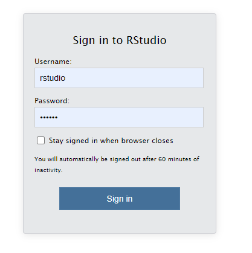
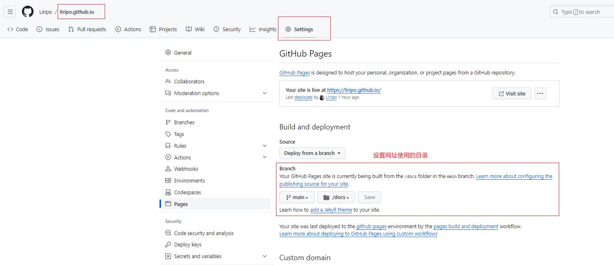

## 简介

[Quarto](https://quarto.org/) 是建立在 Pandoc 之上的开源科学与技术出版系统。它既可以写普通博客，也可以把 Python、R、Julia 或 Bash 代码放进文档里，生成可复现的报告、网站、幻灯片和书籍。

这篇文章记录一条最小可行路径：安装 Quarto，创建博客项目，把输出目录设置为 `docs/`，最后交给 GitHub Pages 发布。

## 安装 Quarto

这里推荐两个选择：

1. 按照[官网](https://quarto.org/docs/get-started/)介绍下载安装。

2. 使用带 `quarto` 的 Docker 镜像。我比较喜欢 [rocker](https://rocker-project.org/images/versioned/rstudio.html) 项目的 `tidyverse` 镜像，它基于 RStudio 镜像，适合作为 R 相关开发的基础环境。

> ps: 我选择此镜像是顺便作为 R 方面开发的基础镜像。

```R
# pull 镜像
docker pull rocker/tidyverse:latest
# 运行, 挂载自己本地的路径，我习惯将整个D盘挂载到镜像中。
docker run -d -ti -p 8787:8787 -e ROOT=TRUE -e PASSWORD=《你的密码》 -v 《本地路径，可以整个D盘》:《镜像目录》 rocker/tidyverse
```

这样就可以打开浏览器，访问 <http://localhost:8787> 进入 RStudio IDE。默认用户名是 `rstudio`。



## 创建博客

Quarto 官方文档已经把博客项目的初始化步骤写得很清楚，可以直接参考：

<https://quarto.org/docs/websites/website-blog.html>

## 发布到 GitHub Pages

网址形如 `https://<用户名>.github.io` 的站点通常可以直接用 GitHub Pages 托管。

1. 在 GitHub 新建一个名为 `<用户名>.github.io` 的仓库。

2. 设置仓库的 Pages 选项，如下图所示：



3. 修改博客项目下的 `_quarto.yml`，将输出目录设置为 `docs/`。

```{.bash filename="_quarto.yml"}
project:
  type: website
  output-dir: docs
```

4. 在仓库根目录添加 `.nojekyll` 文件，告诉 GitHub Pages 不要再用 Jekyll 处理已经渲染好的站点。

```{.bash filename="terminal"}
touch .nojekyll
```

5. 渲染网站并发布。

```{.bash}
# quarto 渲染网站
quarto render
# 使用 git 将渲染好的网站发送到刚刚创建好的仓库中
git push
```
